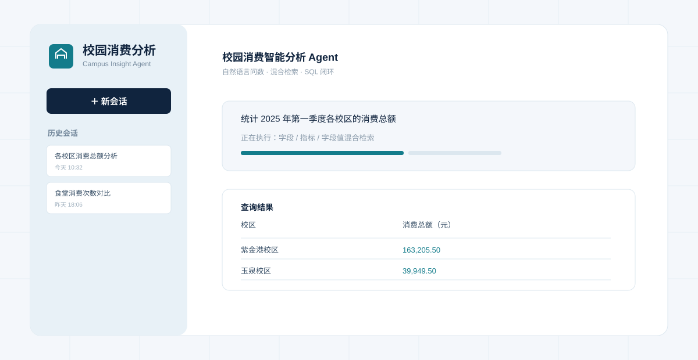
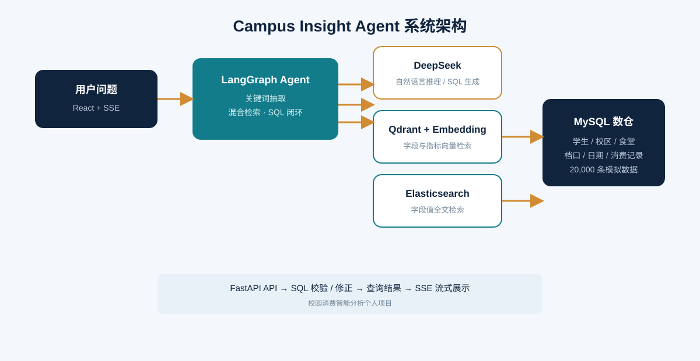

<div align="center">
  <h1>校园消费智能分析 Agent</h1>
  <p><strong>Campus Insight Agent</strong></p>
  <p>面向校园消费场景的自然语言问数与数据分析个人项目</p>
  <p>
    
    
    
    
  </p>
</div>

## 项目简介

这是一个面向校园管理和食堂运营场景的 AI 数据分析个人项目。用户可以直接使用自然语言提问，例如“统计各校区的消费总额”或“查询消费总额最高的档口”，系统会自动理解问题、检索数据资产、生成并校验 SQL，最后返回查询结果。

项目完整实现了“自然语言问题 → 元数据检索 → 多阶段 Agent 推理 → SQL 生成与修正 → 数据库执行 → 流式结果展示”的工程链路。





## 核心功能

- 自然语言查询校园消费数据
- 字段、指标、字段值三路混合检索
- LangGraph 多阶段 Agent 工作流
- SQL 自动生成、语法校验和错误修正
- FastAPI + SSE 流式返回执行进度
- 查询结果表格化展示与复制
- 历史会话本地保存和重新打开
- 魔法棒快捷填入示例问题
- Docker 一键启动 MySQL、Qdrant、Elasticsearch 和 Embedding 服务

## 模拟数据

| 数据对象 | 规模 |
| --- | ---: |
| 学生 | 500 名 |
| 校区 | 3 个 |
| 食堂 | 4 个 |
| 档口/窗口 | 6 个 |
| 日期样本 | 20 天 |
| 消费记录 | 20,000 条 |

主要数据表包括 `dim_student`、`dim_canteen`、`dim_stall`、`dim_date` 和 `fact_consumption`。

## 技术架构

| 层次 | 技术 | 作用 |
| --- | --- | --- |
| 前端 | React、Vite、Tailwind CSS | 聊天式问数界面和结果展示 |
| Agent | LangGraph、LangChain、DeepSeek | 编排推理流程和生成 SQL |
| 后端 | FastAPI、SSE | 提供查询接口和流式事件 |
| 业务数仓 | MySQL 8.0 | 保存校园消费事实与维度数据 |
| 元数据检索 | Qdrant、Elasticsearch | 向量检索与字段值全文检索 |
| 向量模型 | BAAI/bge-large-zh-v1.5 | 生成字段和指标向量 |
| 部署环境 | Docker Compose | 管理本地基础服务 |

## 系统流程

```text
用户自然语言问题
        ↓
关键词抽取
        ↓
字段 / 指标 / 字段值混合检索
        ↓
候选表和指标过滤
        ↓
补充数据库上下文
        ↓
生成 SQL → 校验 SQL → 必要时修正 SQL
        ↓
执行 MySQL 查询
        ↓
SSE 流式返回进度与结果
```

## 快速运行

### 1. 准备环境

- Python 3.14+
- uv
- Docker Desktop（启用 WSL2）
- Node.js 与 pnpm

### 2. 配置大模型 Key

```powershell
Copy-Item .env.example .env
```

在 `.env` 中填写自己的 DeepSeek Key：

```env
LLM_API_KEY=your_deepseek_api_key
```

默认配置位于 `conf/app_config.yaml`：

```yaml
model_name: deepseek-chat
base_url: https://api.deepseek.com
```

### 3. 安装、启动和构建元数据

```powershell
uv sync
docker compose -f docker/docker-compose.yaml up -d
uv run python -m app.scripts.build_meta_knowledge -c conf/meta_config.yaml
```

### 4. 启动后端

```powershell
.\.venv\Scripts\activate
python -m uvicorn main:app --reload --host 127.0.0.1 --port 8000
```

后端文档：[http://127.0.0.1:8000/docs](http://127.0.0.1:8000/docs)

### 5. 启动前端

新开一个终端：

```powershell
cd frontend
pnpm install
pnpm dev --host 127.0.0.1
```

前端地址：[http://127.0.0.1:5173/](http://127.0.0.1:5173/)

## 示例问题

- 统计 2025 年第一季度各校区的消费总额，并按金额从高到低排序
- 统计 2025 年 3 月各食堂的消费次数和消费总额
- 查询紫金港校区消费总额最高的前 5 个档口
- 按学院统计 2025 年第一季度的人均消费

## 项目结构

```text
campus-insight-agent/
├── app/                 # Agent、API、客户端、仓储和业务服务
├── conf/                # 应用配置与元数据配置
├── docker/              # Docker Compose、MySQL 初始化脚本
├── frontend/            # React + Vite 前端
├── prompts/             # SQL 生成、修正和检索 Prompt
├── main.py              # FastAPI 应用入口
└── pyproject.toml       # Python 项目依赖
```

## 简历项目描述

> 独立设计并实现校园消费智能分析 Agent，基于 LangGraph 编排关键词抽取、字段/指标混合检索、SQL 生成校验与执行闭环；使用 MySQL 构建 2 万条校园消费模拟数仓，结合 Qdrant 向量检索、Elasticsearch 全文检索和 DeepSeek，实现自然语言查询到结构化结果的流式返回，并完成 React 数据问答界面与本地历史会话功能。

## 后续可扩展方向

- 消费趋势图和多维分析仪表盘
- CSV/Excel 结果导出
- 用户登录和数据权限控制
- 消费异常检测与运营预警

## 开源说明

本项目是在开源问数 Agent 工程基础上进行的校园消费场景改造与个人项目化整理，保留 MIT License，并对业务数据、元数据、界面、项目命名和文档进行了重新设计。
